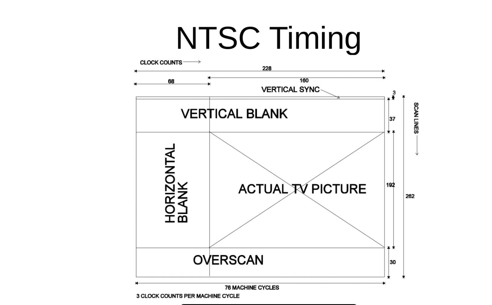
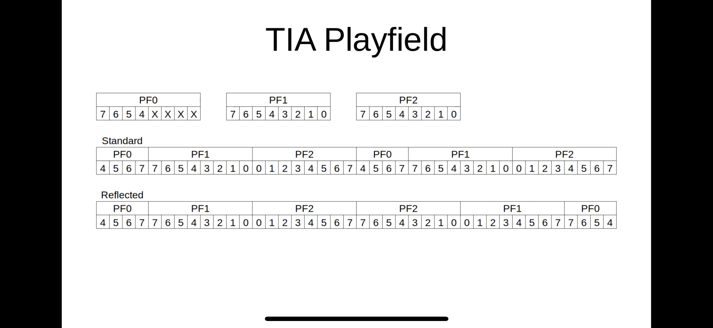

# NOTES about course

* this course is offered by udemy.  
* the instructor is Gustavo Pezzi; the notes that follow are my notes from his course.
* see: https://www.udemy.com/course/programming-games-for-the-atari-2600/learn/lecture/16077318#overview

# Hardware and Specs

Opens with general discussion about gaming elements: 
*  Player 1
*  Player 2
*  Scoreboard
*  Ball
*  Playing field
*  Collision

## 1975 console based on programmable design
* rom cartridges
* called Stella
* options were 8080, Motorola 6800, mos 6502
* 6502 won cause it was cheap
* CPU: 1.19 Mhz 6507 processor ( cheaper version of 6502)
* Audio/Video: TIA Chip (Television Interface Adapter)
* RAM: 128 bytes 6532 RIOT Chip  (RAM I/O Timer)
* ROM: game cartridge; 4kB
* Input: Two controller ports - joysticks, paddle
* Output: TV via RCA Connector (NTSC, PAL, SECAM)

## Models:
* 1977 - 2600   "Heavy Sixer" 
* 1978 - 2600   "Light Sixer"
* 1980 - 2600-A "Four-Switch"
* 1981 - 2600   "Darth Vader"
* 1986 - 2600   "JR."

## Parts:
* an overview of the board.

```
      |-----------------|
      | cartridge/ROM   |
      |-----------------|

        [  6532 RIOT  ]
	  
	  [ 6507 CPU ]

      [ TIA             ]	  
```

* A minimal design.

## Who uses the 6502 family
* Apple IIe
* BBC Micro
* Commodore VIC-20
* Commodore 64 
* Tamagotchi
* Atari 2600
* NES
* Bender Rodriguez (from Futurama ha ha)

## Quick overview of 6502

* pin2 - RDY pin (strobe it for next thing)
* pin4 - IRQ
* data bus: pin 33 - 26 (D0 - D7) <-- 8bit processor (so 8 bits at a time) 
* address bus: pin 9-20 (A0 - A11) 

* 8bits for the data bus
* 16bits for the address bus

## The 6507 variations 
*  no IRQ, no NIM
*  pin 5-pin14 A0-A9
*  pin 17-15 A12-A10
*  pin 25-pin18 (D0-D7)

### TIA - PAL vs NTSC 
    * colors
    * scan lines
    * some variety

* We will focus on the NTSC


# Binary and Hexadecimal

* How do we store information "in the metal"?
* High voltage vs Low Voltage
* 1 vs 0

* A very standard decimal system overview
* A very standard binary system overview
* Mentioned the 12 base system and the hand trick; coolness.

## Hexadecimal

* 0123456789ACDEF

```
00011011     (byte)
0001 1011   (2 nibble)
   1    B    
````

* This simple mapping between binary and hexadecimal makes it easy to organize.
* So, programmers typically usually hex for memory

* 6502 instructions map logically to hexadecimal. 
* eg. load value $3F


### Notation
*  Decimal     #2
*  Hexadecimal $2F
*  Binary      %00010011


## Processor Overview

### 6502/6507

* 13 address pins, and 8 data pins
* reminaing pins - clock, power, reset, gnd etc
* no IRQ/NMI (very different from other 6502s, that use interupts)

* seven main parts
* 1.19 million times per secoind
* tick is clock cycle

```
   [ data bus                                                           ]
    --+------+---+--+---------+-+---+------------+-----------------------
      |      |   |  | N       | |   |            |        +--------+
    Input/   P   S  P V       X Y   accumulator -|--+     | MEMORY |
    Output   C   P  | B/D/I   | |   |    |       |  |     +--------+
      |      |   |  | Z/C     | |   +-- ALU------+  |
    --+------+---+--+---------+-+-------------------+---------------------
   [ address bus                                                         ]
```

* ALU - arithmetic logic unit
*    - add/sub/etc
*    - greater than
*    - logical operations

* Registers
* - 6 addrerssible addresses
* -- PC program counter (address of next instruction)
* -- SP stack pointer (top of the stack) 
* -- P (processor flags - NV-B DIZC)
* -- X general purpose
* -- Y general purpose
* -- Accumulator (A) - general purpose, BUT used by ALU
*    (ALU gets value from A, Databus result goes into A)
 
 ### Registers are 8 bit
 * SP is 16bits - weird 0000001:nnnnnnnn
 * PC is 16bits

 * c carry
 * z zero
 * i irq disabled always 1 in 6507
 * d decimal mode re: BCD binary-coded decimal
 * b break instruction
 * -
 * v overflow
 * n negative

# Carry and Overflow flag

* register P from above

* bits for c and v

* How do we represent negative numbers?

* if the last instruction was negative , n =1
* what is a carry?
* example

```
  c n
  0 11111111
+ 0 00000001
-------------
  1 00000000
```

## So negative numbers

* 01111111  
* number is either positve or negative
* so we need one bit
* use the most significant bit for represent
* so 0 is positive, and 1 is negative
* so values range from -127 to 127
* This called sign & magnitude

### But this is NOT how we do this.
* This gives us positive 0 or negative 0. which is weird.
* Adding becomes odd

## Two's complement


* -128 64 32 16 8 4 2 1

* how many -128s the number has
* one way represent 0.
* and the math works

## Examples

```
-128 |  64 |  32 |  16 |   8 |   4  |   2 |   1 |
  0      1     1     1     1     1      1     1   = 127
  1      0     0     0     0     0      0     0   = -128
  1      1     1     1     1     1      1     1   = -1
```

* Consider:

```
   01111111       127
+  00000001         1
   --------
   10000000      -128 
```

* no carry happens. 
* so now what?
* twos complement overflow
* the flag v gets set

# Assembler
* link: http://www.6502.org/tutorials/6502opcodes.html

* provide a way to send instructions to processor.
* how do tell processor #2 into the A register

```
send 1010 1001 0000 0010
            A9         2
```

* op code :  A9 02
* assembly: LDA #2

* assembler will translate from assembly to opcodes


## More examples

```
LDA #2      ; store 2 into A
STA $2B     ; store whats in A to address $2b
LDX $1234   ; load x register whatever value at 1234
DEX         ; decrement (x--) X register
```

assembles to

```
a9 02 
85 2b
ae 34 12  <-- note the order. little endian (the LSB is first)
ca
```

# Popular 6502 Assembly codes

```
LDA ; load
LDX
LDY

STA ; store
STX
STY

ADC ; add with carry
SBC ; subtract with carry
(no multiply, no addition)

CLC clear carry (before addition)
SEC sets the carry (before subtraction)

INC ; increment
INX
INY

DEC ; decrement
DEX
DEY

z=1 if result is 0, 0 otherwise
n=1 if 7bit is set. 0 otherwise

JMP  ; jump (like a goto)
BCC  ; branch on carry clear
BCS  ; branch on carry set
BEQ  ; branch if equal to zero
BNE  ; branch on if not 0
BMI  ; branch on minus
BPL  ; branch on plus
BVC  ; branch overflow clear
BVS  ; branch overflow set
```

* Example of loop

```
       ldy #100 ; y= 100
Loop:
       dey      ; y--
       bne Loop ; repeat until y==0

```
Note: at this point, the course is doing some actual examples; see
* ./cleanasm

# Different Address Modes


* Immediate: 
- LDA #80  ; load A register with the literal value decimal 80
- A9 50

* Absolute:
- LDA $80  ; load A register from address $80  --> question: hex or decimal?
- A5 80

* Hmm - seems that it HEX. 
* So is the hash # meaning immediate mode then?

* Ah, he does explain this, thank you: 
LDA #$80  ; load A register with literal hexadecimal 80 


# VCS Memory Map

Some ideas we have seen:

* ROM: $F000 - $FFFF
* page 0: $0000 - $00FF

Where are things located in address space

VCS bus - OK, first time I recall hearing this. Let me scroll up and look at my notes...
* we had an address bus and a databus.  I wonder what he is talking about? 
Anyway. this "new?" bus connects to the 
*  TIA - television interface adapter.  (OK)
*  PIA - Peripheral Interface Adapter.  (New, but sure this makes sense)
*  ROM - Read Only Memory -Cartridge (OK)

VCS Memory Map

```
$00   TIA registers - send instruction to TV (color background, etc)
$01
$02


$7D
$7E
$7F
```

If you put a value in $09 - that color will go into the background.

```
$80  PIA RAM  
$81
$82


$FD
$FE
$FF
```

```
$F000   Cartridge ROM
$F001
$F002


$FFFC  reset vector
$FFFD
$FFFE  break interupt
$FFFF
```
Do we need to recall these? Well no. There is a file called vcs.h (it was included with dasm) with these
defined in it.

From: ~/projects/dasm/dasm-2.20.14.1$ vi ./machines/atari2600/vcs.h

```
    ; DO NOT CHANGE THE RELATIVE ORDERING OF REGISTERS!
    
VSYNC       ds 1    ; $00   0000 00x0   Vertical Sync Set-Clear
VBLANK      ds 1    ; $01   xx00 00x0   Vertical Blank Set-Clear
WSYNC       ds 1    ; $02   ---- ----   Wait for Horizontal Blank
RSYNC       ds 1    ; $03   ---- ----   Reset Horizontal Sync Counter
NUSIZ0      ds 1    ; $04   00xx 0xxx   Number-Size player/missle 0
NUSIZ1      ds 1    ; $05   00xx 0xxx   Number-Size player/missle 1
COLUP0      ds 1    ; $06   xxxx xxx0   Color-Luminance Player 0
COLUP1      ds 1    ; $07   xxxx xxx0   Color-Luminance Player 1
COLUPF      ds 1    ; $08   xxxx xxx0   Color-Luminance Playfield
COLUBK      ds 1    ; $09   xxxx xxx0   Color-Luminance Background
CTRLPF      ds 1    ; $0A   00xx 0xxx   Control Playfield, Ball, Collisions
REFP0       ds 1    ; $0B   0000 x000   Reflection Player 0
REFP1       ds 1    ; $0C   0000 x000   Reflection Player 1
PF0         ds 1    ; $0D   xxxx 0000   Playfield Register Byte 0
PF1         ds 1    ; $0E   xxxx xxxx   Playfield Register Byte 1
PF2         ds 1    ; $0F   xxxx xxxx   Playfield Register Byte 2
RESP0       ds 1    ; $10   ---- ----   Reset Player 0
RESP1       ds 1    ; $11   ---- ----   Reset Player 1
RESM0       ds 1    ; $12   ---- ----   Reset Missle 0
RESM1       ds 1    ; $13   ---- ----   Reset Missle 1
RESBL       ds 1    ; $14   ---- ----   Reset Ball
AUDC0       ds 1    ; $15   0000 xxxx   Audio Control 0
AUDC1       ds 1    ; $16   0000 xxxx   Audio Control 1
AUDF0       ds 1    ; $17   000x xxxx   Audio Frequency 0
AUDF1       ds 1    ; $18   000x xxxx   Audio Frequency 1
AUDV0       ds 1    ; $19   0000 xxxx   Audio Volume 0
AUDV1       ds 1    ; $1A   0000 xxxx   Audio Volume 1
GRP0        ds 1    ; $1B   xxxx xxxx   Graphics Register Player 0
```
 
In our assembly, we include "vcs.h" and "macro.h"

(so I guess I better copy these files into the project hmm?)

He provides a link for this.  I have the source, so for now, I will use that.

```
steve@cplusdev:~/projects/atari2600_udemy$ mkdir include
steve@cplusdev:~/projects/atari2600_udemy$ cd include
steve@cplusdev:~/projects/atari2600_udemy/include$ cp ~/projects/dasm/dasm-2.20.14.1/machines/atari2600/vcs.h .
steve@cplusdev:~/projects/atari2600_udemy/include$ cp ~/projects/dasm/dasm-2.20.14.1/machines/atari2600/macro.h .
```

Now I add to the top of my assembly files

```
include ../include/vcs.h
include ../include/macro.h
```
He mentions also that the page of memory is 256 bytes, when we only have 128 byte system. 
I assume that there is a mode thing happening, but not explained.

yet.

Next, we review the vcs.h.  

OK see ./colorbg for code example
He is moving the .h files into the project.  
I really don't want to do this; it will result with many .h files distributed.
Do I have to?

For colors:
link: https://en.wikipedia.org/wiki/List_of_video_game_console_palettes
for example, yellow is 1,14 MSB,LSB.
or 1E

# CRT Video Synchronization

Note: I actually watched this session twice. Its pretty deep.

Put a value into a register - this maps to TIA

"lockstep" ?

NTSC vs PAL

* General discussion about how CRT scan lines work - scanlines are "beamed" onto a phosphorescent screen
* Now adays, we have a place for every pixels (ie screen buffers)
* But, on an Atari, we dont have nearly enough memory for that
* So, we store scanlines
* and need to sync /reprogram on a per scanline basis

"Racing the beam" - reprogram TIA chip for each scanline.

So, timing is really important, we will need to sync somehow.

Horizontal blank: 
(color clocks sorta like pixels)

|<-- 68 color clocks -->|<-- 160 color clocks --------------------------> |
|<-- not visible     -->|<--  visible                                 --> |

The processor is halted until WSYNC is recieved from the TIA. 
(so the processor sends instruction to the TIA and halts.  Then the TIA strobes the WSYNC pin.)
(you can look at the pin out of the 6507 and see this PIN)

Vertical Sync - NTSC

```
| <-- scanline 1                                                      --> |
| <-- scanline 2                                                      --> |
| <-- scanline 3                                                      --> |
| <---------------------------------------------------------------------> |
| <---                         VERTICAL BLANKS                        --> |
..
   37 in total
..
| <----------------------+----------------------------------------------> |
| <-- 68 color clocks -->|<-- 160 wide         -------------------------> |
| <-- not visible     -->|<-- 192 high                                --> |
|                        |                                                |
...   192 of these       |                                                |
|                        |                                                |
| <----------------------+----------------------------------------------> |
| <-- over scan                                                       --> |
|  30 of these
| <---------------------------------------------------------------------> |

```

 

Assembly code example:

NextFrame:
    lda #2
    sta VBLANK      ; turn on VBLANK
    sta VSYNC       ; turn on VSYNC

    sta WSYNC       ; store A in WSYNC halts and waits to be strobed
    sta WSYNC       ; previsious happened, wait for the next
    sta WSYNC       ; prev happened; wait for the next

    lda #0          ; shut it down
    sta VSYNC

    lda #37
LoopVBlank:
    sta WSYNC   ; hit WSYNC to wait for TIA to strobe it
    dex
    bne LoopVBlank
    lda #0
    sta VBLANK     ; shut it down

; --- we do similair things for the next areas ...

# Painting the CRT
see ./rainbow/rainbow.asm


# TIA Screen Objects
* background
* playfield - objects/obstacles/walls in the "arena"
* player 0 - size, width, height. color
* player 1
* missle 0
* missle 1
* ball

We can poke different values for these. 

Scanlines are rendered based on /via the TIA registers

TIA registers are mapped into our memory.

* background takes whole visible background (160x192)
* one color per scan

* playfield uses a 20 bit pattern, over left side of scanline
* one color per scan
* either a repeat, or a reflection of the same pattern
* this is odd I think
* PF0, PF1, PF2
* COLOUPF
* CTRLPF
- D0: Reflect
- D1: Score
- D2: Priority
- D4-D5: Ball size (1, 2, 4, 8)

The playfield is build by reading PF0, PF1 and PF2

```
|   Left side of the play field                                               |
|   PF0        |   PF1                        |   PF2                         |
|4 | 5 | 6 | 7 |7 | 6 | 5 | 4 | 3 | 2 | 1 | 0 | 0 | 1 | 2 | 3 | 4 | 5 | 6 | 7 |
```

Set the register, scanline, repeat.

PF0 = 0000     @ <--- read this way
PF1 = 00000000 @ ---> read this way
PF2 = 00000000 @ <--- read this way
REFLECT = 0

scanline = "                                       "

Another:

```
PF0 = 0001     @ <--- read this way
PF1 = 00000000 @ ---> read this way
PF2 = 00000000 @ <--- read this way
REFLECT = 0
----------- PF0 PF1     PF2
----------- 45677654321001234567
----------- 0123456789012345678901234567890123456789
scanline = "☐                   ☐                   "
```

Another:

```
PF0 = 0011     @ <--- read this way
PF1 = 00000000 @ ---> read this way
PF2 = 00000000 @ <--- read this way
REFLECT = 0
----------- PF0 PF1     PF2
----------- 45677654321001234567
----------- 0123456789012345678901234567890123456789
scanline = "☐☐                 ☐☐                  "

```

Another:

```
PF0 = 1111     @ <--- read this way
PF1 = 11110000 @ ---> read this way
PF2 = 00000000 @ <--- read this way
REFLECT = 0
----------- PF0 PF1     PF2
----------- 45677654321001234567
----------- 0123456789012345678901234567890123456789
scanline = "☐☐☐☐☐☐☐☐           ☐☐☐☐☐☐☐☐            "
```

Another:

```
bits  76543210
PF0 = 1111xxxx @ <--- read this way
PF1 = 11111110 @ ---> read this way
PF2 = 00010101 @ <--- read this way
REFLECT = 0
----------- 0123456789012345678901234567890123456789
----------- PF0 PF1     PF2
----------- 45677654321001234567
scanline = "☐☐☐☐☐☐☐☐☐☐☐ ☐ ☐ ☐   ☐☐☐☐☐☐☐☐☐☐☐ ☐ ☐ ☐   "
```

```
My note: Look, I don't know why they did it this way, but its not complicated. 
All you need to remember is the bit pattern rendering order: 45677654321001234567 
and that PF0 only renders its top most 4 bits.  The other half of the screen is either
a repeat (so 45677654321001234567 again) or a reflection.

So the question now is, how do they do reflection?  Do they re-order the bits, or the PFn, or both?
Normal order is PF0PF1PF2 and this defines 20 blocks.
A nonreflect (so REFLECT=0) looks like: PF0PF1PF2PF0PF1PF2.

So what does it look like when REFLECT=1?

Ah, he provides an example
```


Another:

```
bits  76543210
PF0 = 1111xxxx @ <--- read this way
PF1 = 11111110 @ ---> read this way
PF2 = 00010101 @ <--- read this way
REFLECT = 1
----------- 0123456789012345678901234567890123456789
----------- PF0 PF1     PF2     PF2     PF1     PF0
----------- 4567765432100123456776543210012345677654
scanline = "☐☐☐☐☐☐☐☐☐☐☐ ☐ ☐ ☐      ☐ ☐ ☐ ☐☐☐☐☐☐☐☐☐☐☐"
```

Ok, the key here is total bit reversal.

Lastly, note how this is repeated, to draw out our play field for the game:

```
scanline = "☐☐☐☐☐☐☐☐            ☐☐☐☐☐☐☐☐            "
scanline = "☐☐☐☐☐☐☐☐            ☐☐☐☐☐☐☐☐            "
scanline = "☐☐☐☐☐☐☐☐            ☐☐☐☐☐☐☐☐            "
scanline = "☐☐☐☐☐☐☐☐☐☐☐ ☐ ☐ ☐   ☐☐☐☐☐☐☐☐☐☐☐ ☐ ☐ ☐   "
scanline = "☐☐☐☐☐☐☐☐☐☐☐ ☐ ☐ ☐   ☐☐☐☐☐☐☐☐☐☐☐ ☐ ☐ ☐   "
scanline = "☐☐☐☐☐☐☐☐☐☐☐ ☐ ☐ ☐   ☐☐☐☐☐☐☐☐☐☐☐ ☐ ☐ ☐   "
scanline = "☐☐☐☐☐☐☐☐☐☐☐ ☐ ☐ ☐   ☐☐☐☐☐☐☐☐☐☐☐ ☐ ☐ ☐   "
scanline = "☐☐☐☐☐☐☐☐☐☐☐ ☐ ☐ ☐      ☐ ☐ ☐ ☐☐☐☐☐☐☐☐☐☐☐"
scanline = "☐☐☐☐☐☐☐☐☐☐☐ ☐ ☐ ☐      ☐ ☐ ☐ ☐☐☐☐☐☐☐☐☐☐☐"
scanline = "☐☐☐☐☐☐☐☐☐☐☐ ☐ ☐ ☐      ☐ ☐ ☐ ☐☐☐☐☐☐☐☐☐☐☐"
scanline = "☐☐☐☐☐☐☐☐☐☐☐ ☐ ☐ ☐      ☐ ☐ ☐ ☐☐☐☐☐☐☐☐☐☐☐"
scanline = "☐☐☐☐☐☐☐☐☐☐☐ ☐ ☐ ☐      ☐ ☐ ☐ ☐☐☐☐☐☐☐☐☐☐☐"
```



# Player

* player0 is 8 bit pattern GRP0  with forground color COLUP0
* can be changed per scan line
* 10100001 becomes "☐ ☐    ☐"
* repeat this for player1, GRP1 and COLUP1

* you can "stretch" the player0 using NUSIZ0
* you can "reflect/invert" using REFP0

* ok, this is random functionality.

```
000 player
010 player player
011 player player player
100 player                       player
101 p l a y e r
110 player        player         player
111 p  l  a  y  e  r
```
And of course, reflect causes this to be reflected

```
000 reyalp
010 reyalp reyalp
011 reyalp reyalp reyalp
100 reyalp                       reyalp
101 r e y a l p 
110 reyalp        reyalp         reyalp
111 r  e  y  a  l  p
```


# missles an balls

* its one "pixel"
* can be stretched (2, 4, 8)
* M0 and M1 use P0 and P1 colors
* BL uses the PF foreground
* only two missles on the same scan line. (which makes sense)

* for each scan line, set up TIA need to set up register before the "beam" reaches
* very short - need to be fast and optimal

## designing a basic layout

* he starts with a basic "box" layout for the playfield
```
----------- 4567765432100123456776543210012345677654
7 blanks
7 solid      XXXXXXXXXXXXXXXXXXXXXXXXXXXXXXXXXXXXXX 
             XX                                  XX 
164 lines    XX                                  XX 
             XX                                  XX 
7 solid      XXXXXXXXXXXXXXXXXXXXXXXXXXXXXXXXXXXXXX 
7 blanks    
----------- 4567765432100123456776543210012345677654
```

This will be built in the code ./playfield/playfield.asm
(he uses the 8bitworkshop tool javatari; thats fine but doesn't go well with my git repo)

# Playfield exercise

Not entirely sure what he wants here.
But the exercise is to show that we can manipulate PFn to modify the playfield
In this case, we can just add bit 7 to PF2 and create the center bar:

```
----------- 4567765432100123456776543210012345677654
7 blanks
7 solid      XXXXXXXXXXXXXXXXXXXXXXXXXXXXXXXXXXXXXX 
             XX                XX                XX 
164 lines    XX                XX                XX 
             XX                XX                XX 
7 solid      XXXXXXXXXXXXXXXXXXXXXXXXXXXXXXXXXXXXXX 
7 blanks    
----------- 4567765432100123456776543210012345677654
```

See ./playfield_exercise/playfield.asm for solution.
(I also messed about with couple variations, like setting bit 6 in PF2.)


# Player Bitmap and Scoreboard
see ./screenobjects/screenobjects.asm

# Scoreboard Color
see ./screenobjects_score_fix/screenobjects.asm
also, note about REPEAT n /REPEND.  This is a straight up cut/paste. It can result in a lot of used space on the cartridge.

# Varibles in memory
also see ./screenobjects_score_fix/screenobjects.asm

# Registers & Variables

For example:

```
int lives = 5;
int level = 1;
int score = 30;
```

Is a register the same as a variable?
* no.  variables need space in memory in RAM
* registers have dedicated space in the CPU. 
* registers may do specific things for the CPU (like a SP register)

* int lives 5;
* the value needs to be copied to the register from RAM
* acted on
* then the value of register can be copied back

eg

```
score = score + 1

lda score
ina         ; is this even a thing? well you get the idea
sta score
```


# Positioning

* positioning objects, missles , players etc

* we can create variables at the top of our code
eg)
```
    seg.u Variables
    org $80
PlayerHeight equ 9 ; hard code the sprite height to 9 rows
PlayerYPos byte    ; declare a variable for the sprite

;;;;
;; lookup table for the player graphics
;;;
PlayerBitmap:
    byte #%00000000
    byte #%00101000
    byte #%01110100
    byte #%11111010
    byte #%11111010
    byte #%11111010
    byte #%11111010
    byte #%01101100
    byte #%00110000
;;;
;; lookup player colors
;;;
PlayerColor:
    byte #$00
    byte #$40
    byte #$40
    byte #$40
    byte #$40
    byte #$42
    byte #$42
    byte #$44
    byte #$D2
```
* note the colors and bitmaps are upside down here. 
* its up to use how they are stored though
* why did he do it this way? 

Now we can render:

```
;;;
; draw the 192 vis
;;;
    ldx #192        ; number of scanlines
Scanline:
    txa             ; A = X
    sec             ; set the carry flag
    sbc PlayerYPos  ; subtract sprite Y coordinate
    cmp #P0Height   ; are we inside the sprite height bounds
    bcc LoadBitmap  ; if the result < SpriteHeight, call subroutine
    lda #0          ; else, set index to 0

LoadBitmap:
    tay
    lda P0Bitmap,Y  ; load the player bitmap slice of data
    sta GRP0        ; set graphics for player 0 slice
    lda P0Color,Y   ; get the player color from lookup
    sta COLUP0      ; set the color for the player 0 slice
    sta WSYNC       ; wait for next scanline
    dex
    bne Scanline    ; repeat until finished
```

* we start at 192 at the top. so the Y coordinates are reversed.
* Y=0 is the bottem left.

* Look at ./verticalpos/verticalpos.asm for an example
* ha ha - he forgot to mention that he decrements the PlayerYPos
* (I spent 15 mins wondering why his apple drops, and eventually put in my own decrement)
* Then I went back to the video, just to hear that oh yah, need to ...

# Horizontal Position

* annoying becuase
- say at a specific xpos
- start scan line at left
- control how long does it take
- until the beam gets to our xpos
- how many cpu clock cycles to get the position
- once those cycles passed, we reset player 0 then the sprit is positioned

* wait for TIA
* write to RESP0 (or equivalent for other sprites)

* for a certain X horizontal psotion on the scrtene

```
sta WSYNC
Wait (X+68)/3 CPU cycles
recall HBLANK, 68 TIA cycles. So we need to account for that
TIA clock cycles (pixels)
divided by 3 because TIA clock cycles are slower than CPU; 3 TIA clock cycles == 1 CPU clock cycle
strobe (write to) register RESP0


| <-- 68 color clocks -->|<-- 160 wide         -------------------------> |
| HBLANK                 | Visible Scanline                               |

```

So, code similair to:

```

    ldx #5     ; x = 5
    sta WSYNC  ; wait for next scanline

Loop:
    dex        ; x--
    bne Loop   ; branch if x not zero
    sta RESP0  ; fix the player0 horizontal position


```
* But, how long, where does X goes?
* How many clock cycles did all that take?
```
Each insturcion of 6507 takes a certain amount of clock cycles
  DEX takes 2 CPU cycles
  BNE takes 3 CPU cycles 
  so 5 cycles in loop
5 cycles ==> 15 clock cycles
So 75 TIA clock cycles
```

# Fine Horizontal Positioning

* the TIA has special registers that allow fine positioning, by tweaking -8 to +7 pixels
* so set rough position by 15
* then set fine position
* for desired X

```
WSYNC
wait (X+68)/15 and save the division remainder
example:  47/15 == 15*3 + 2
strobe RESPO at 15 incrment
write to HMP0 register to fine tune
strobe WSYNC again
strobe HMOVE to apply

```

Example code:

```
    lda P0XPos          ; A = desired X position
    sta WSYNC           ; wait for next strobe
    sta HMCLR           ; clear old horizontal position

    sec                 ; set carry flag before subtraction
DivideLoop:
    sbc #15             ; subtract 15
    bcs DivideLoop      ; loop while carry flag set

    eor #7              ; adjust the range from -8 to 7
    asl                 ; shift left by 4; HMP0 uses only TOP 4 bits
    asl 
    asl
    asl
    sta HMP0            ; set fine position
    sta RESP0           ; set player at the 15 step
    sta WSYNC           ; wait for next scanline
    sta HMOVE           ; apply fine position

```

Next up, example in action : horizontalpos/horizontalpos.asm

# Counting Clock Cycles

* this can be very very important
* constantly in a race against in the beam
* clock cycles per instruction
* each instuction takes a certain amount of clock cycles
* refer to 6502.org/tutorials/6502opcodes.html
* but note that depending on the instruction, on the addressing scheme, etc the timing may be different
* We will have to count clock cycles.
* also instrucitions can take longer in certain conditions.
* a branch not taken is 2 cycles, add one if taken, add another if a page boundry is crossed

# The NOP

* the NOP instruction does nothing
* the NOP instruction uses two clock cycles

# Joystick Input

* input ports/registers
* $280 SWCHA Joysticks/Controllers 
* $282 SWCHB Front-panel switches
* (from the PIA)
* VCS has several switches in the fron panel
- A/B difficulty switch for player 0 and player 1
- black-white /color
- game select
- game reset

* mostly interested in SWCHA
* 10111111
* up/dn/lf/rt
* LSB is player 1, MSB is player 0
* 0 means depressed - active.

```
 1 - P0 RT
 0 - P0 LF
 1 - P0 DN
 1 - P0 UP
 1 - P1 RT 
 1 - P1 LF
 1 - P1 DN
 1 - P1 UP

```

Example code

```

CheckP0Up:
    lda #%0001000
    bit SWCHA
    bne CheckP0Down
    ; code for P0-Up here.

CheckP0Down:
    lda #%0010000
    bit SWCHA
    bne CheckP0Left
    ; code for P0-Down here.

CheckP0Left:
    lda #%01000000
    bit SWCHA
    bne CheckP0Right
    ; code for P0-Left here.

CheckP0Right:
    lda #%10000000
    bit SWCHA
    bne NoInput
    ; code for P0-Right here.

NoInput:
    ; cont.

```

* recall BIT tests the A reg, logical AND, sets flags, but doesn't store results.

OK - time for a practical example ./joystick/joystick.asm

# Bitwise Operators

* AND, OR and XOR

```
    01110111
AND 11010010
    --------
    01010010
```

```
    01110111
ORA 11010010
    --------
    11110111
```


```
    01110111
EOR 11010010
    --------
    10100101
```

```
NOT 01110111
    10001000

There is NO NOT in 6502.

So we XOR 1111111 instead

    01110111
EOR 11111111
    --------
    10001000
```

* BIT is an AND, but doesnt set the A register
* speaking of, these all acts on A register
* eg) EOR $FF ; this is a NOT on whatever is in the A register.


# Subroutines and the Stack

* recall the work we did to do the horizontal movement for player0
* the HMP0 and related manipulation
* We need to do same things, for HMP1. HMM0, HMM1, and HMBL
* so, a subroutine is a really good idea.
* ...
* subroutine:

```
SetObjectXPos subroutine  ; <-- note this
    sta WSYNC
    sec
.Div15Loop                ; <-- note the dot(.) The assembler will make this local
...

    rts                   ; return subroutine

```

To call the subroutine

```
    jsr SetObjectXPos   ; call after setting up X,Y, A registers with expected values.
```

# Stack

* simple idea - place in memory where we can drop values, and later pull off of
* we only have three registers
* stack can "save" your place push 
* do other stuff
* and later pop the value back
* PHA push A to the stack
* PLA pull A from the stack  (pull instead of pop eh)
* stack has a limit. It can overflow.
* example : ./stackpushpop/stackpushpop
* note about example, you need to run it in the debugger to watch the SP and values change.

# Pointers

* direct addressing via labels in memory.
* lda ArrowDown,Y
* then inc Y in a loop, grabbing entries.
* BUT
* sometimes the label is stored in memory too
* so the ArrowDown is stored in memory too
* this is called indirect addressing
* say you have ArrowDown and ArrowUP
* then create a:
```
   SpritePtr word    ; 16 bits (its a memory address)

    lda #<ArrowDown
    sta SpritePtr   ; store in lo byte
    lda #>ArrowDown 
    sta SpritePtr+1
```

```
the memory address of ArrowDown is 16 bits.
We can only store 8 bits in A
So, we grab the < bits into A, then store
and then the > bits into A, then store.
```

Now the indirect addressing is

* ldy #5
* lda (SpritePtr),Y  ; convert SpritePtr to a memory address, add 5, return value at
* sta Value

Its worth noting how useful this is for animations. We can create a PlayerPtr and cycle it through 
various bitmaps, thus making it look "animated".

# Creating Sprites

link: playerpal 2600
https://alienbill.com/2600/playerpalnext.html


# Random Numbers

* ok, no such thing as a "random" number

## LFSR

```
;;;;;;;;;;;;;;;;;;;;;;;;;;;;;;;;;;;;;;;;;;;;;;;;;;;;;;;;;;;;;;;;;;;;;;;;;;;;;;;
;; Linear-Feedback Shift Register
;;;;;;;;;;;;;;;;;;;;;;;;;;;;;;;;;;;;;;;;;;;;;;;;;;;;;;;;;;;;;;;;;;;;;;;;;;;;;;;
;; Code to output a randome value in the accumulator
;;;;;;;;;;;;;;;;;;;;;;;;;;;;;;;;;;;;;;;;;;;;;;;;;;;;;;;;;;;;;;;;;;;;;;;;;;;;;;;
    lda Random      ; Load starting with a random seed
    asl             ; shift left
    eor Random      ; XOR accumulator with Random
    asl             ; shift left
    eor Random      ; XOR accumulator with Random
    asl
    asl
    eor Random
    asl
    rol Random      ; rotate left
```

## Random Bits

```
GenerateRandomBit subroutine
    lda Rand4
    asl
    asl
    asl
    asl
    eor Rand4
    asl
    asl
    rol Rand1
    rol Rand2
    rol Rand3
    rol Rand4
    rts

GenerateRandomByte subroutine
    ldx #8
.RandomByteLoop
    jsr GenerateRandomBit
    dex
    bne .RandomByteLoop
    lda Rand1
    rts

```

* so, wrt to the "bomber" game
* generate a new random byte (value $0 to $ff)
* divide by 4 to limit the result to match the "river" width 
* add 30 pixels to get past the greenfield
* 256 / 4 = 90 .. so 0 - 90
* 30 - 120

# Bit Wise

* recall if you multiply by 10, you just shift left
```
23 * 10 = 230
331 * 10 = 3310
```
* mulitply by 100? well two left shifts
```
 23 * 10
230 * 10
2300
```

* ok, lets divide
```
23/10  = 02
331/10 = 033
51/10  = 05
```

so, right shift.

* and by 100?

```
5911/100 = 0059
is 5911/10 -> 0591/10 -> 0059
```

* and of course, this works in base 2
* multiply by power of 2 is just a left shift 
* divide by port of 2 is just a right shift

```
00000101 * 2 = 00001010
etc etc. pretty simple really.
```

# Collisions

* the TIA has 15 different collision flags
* Pixel perfect collison between objects
* check for collision using CX*** register
* generally check in the update (before we end our frame)
* strobe CXCLR clears all collisions

```

         d7 | d6 | d5 | d4 | d3 | d2 | d1 | d0 |  D7   |  D6   
CXM0P   | 1 |  1 |  . |  . |  . |  . |  . |  . | M0 P1 | M0 P0
CXM1P   | 1 |  1 |  . |  . |  . |  . |  . |  . | M1 P0 | M1 P1
CXP0FB  | 1 |  1 |  . |  . |  . |  . |  . |  . | P0 PF | P0 BL     
CXP1FB  | 1 |  1 |  . |  . |  . |  . |  . |  . | P1 PF | P1 BL
CXM0FB  | 1 |  1 |  . |  . |  . |  . |  . |  . | M0 PF | M0 BL
CXM1FB  | 1 |  . |  . |  . |  . |  . |  . |  . | M1 PF | M1 BL
CXBLPF  | 1 |  1 |  . |  . |  . |  . |  . |  . | BL PF | unused
CXPPMM  | 1 |  1 |  . |  . |  . |  . |  . |  . | P0 P1 | M0 M1

```

* is player0 hitting playfield?
* CXP0FB D7 will be set
* is player0 hitting player1 ?
* CSPPMM D7 will be set

* so, in code:

```
CheckCollisionP0PF:
    lda #%0000000   ; bit 7
    bit CXP0FB
    bne .CollisionP0PF
    jmp EndCollisionCheck
.CollisionP0PF:
    jsr GameOver     ; call a game over subroutine

EndCollisionCheck:
    sta CXCLR   ; finally, clear all collision flags

```

# TIMING

link: https://www.randomterrain.com/atari-2600-memories-tutorial-andrew-davie-17.html

# Audio via TIA

* two sound channels - so we can play two sounds at once.
* (sound on the TV, no speakers on atari2600)
* pitch, frequency, volume, distoration

```
register | register | description ....               | range of value
channel0 | channel1 |                                | 
---------+----------+--------------------------------+--------------------------------------------------
AUDV0    | AUDV1    | changes volume (intensity)     | 0 (off) to 15 highest
AUDF0    | AUDF1    | changes frequency (pitch)      | 0 (highest pitch) to 31 (lowest pitch)
AUDC0    | AUDC1    | changes tone type (distoration | 0 to 15 (pure tone, noise, square wave, buzz, etc
```

* break down the AUDCn :

````
Value  |  Tone Type
-------+-----------------------------
  0    | Silent
  1    | Buzz
  2    | Rumble
  3    | Rumble
  4    | Pure
  5    | Pure
  6    | Square Wave
  7    | Buzz
  8    | White Noise 
  9    | Buzz
 10    | Square Wave
 11    | Silent
 12    | Pure Tone
 13    | Pure Tone
 14    | Square Tone
 15    | Buzz

```

# debugging tool: Gopher2600

* link: https://github.com/JetSetIlly/Gopher2600
* written in go


# Resources

* Stella community/ manual
* AtariAge forum
* Steven Hugg's 8BitWorkshop
* Javatari emulator
* Open source games - look at the code, see what folks are doing

